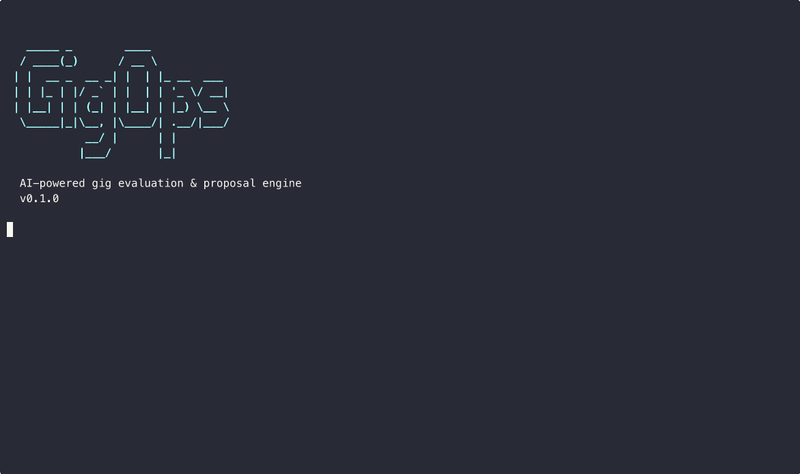

<p align="center">
  <h1 align="center">⚡ GigOps</h1>
  <p align="center"><strong>AI for gig workers, not against them.</strong></p>
  <p align="center">
    <a href="https://github.com/mygigsters/gigops/actions"></a>
    <a href="https://github.com/mygigsters/gigops/blob/main/LICENSE"></a>
    
  </p>
  <br>
  
</p>

<p align="center">
  <a href="LICENSE"></a>
  = 18">
  <a href="https://github.com/nicepkg/gigops/stargazers"></a>
</p>

---

Gig platforms use algorithms to decide what you see, what you earn, and who gets the job. **GigOps flips the script.** It gives freelancers the same AI-powered tools — evaluate gigs before you bid, generate winning proposals, scan for red flags, benchmark your rates, and research clients — all from the command line.

No subscriptions. No lock-in. Runs locally. Your data stays yours.

## 🚀 Quick Start

```bash
# Install
npm install -g gigops

# Configure your LLM provider (pick one)
export ANTHROPIC_API_KEY="sk-..."   # Claude
# or: export OPENAI_API_KEY="sk-..."
# or: export GEMINI_API_KEY="..."
# or: gigops config --provider ollama --model llama3

# Evaluate your first gig
gigops evaluate "https://www.airtasker.com/tasks/some-task-id"

# Or scan a platform for opportunities
gigops scan --platform airtasker --skills "web development, react"
```

## 🛠 Features

| Command | What it does |
|---------|-------------|
| `gigops evaluate <url>` | AI analysis of a gig — worth your time? Red flags? Fair pay? |
| `gigops propose <url>` | Generate a tailored proposal based on the gig + your profile |
| `gigops scan` | Find and rank gigs matching your skills across platforms |
| `gigops rate-check` | Benchmark your rates against market data for your skill set |
| `gigops client-intel <url>` | Research a client — review history, payment patterns, red flags |
| `gigops pipeline` | Manage your active gigs, bids, and pipeline in one view |

## 🌐 Supported Platforms

| Platform | Status |
|----------|--------|
| **Airtasker** | ✅ Full support |
| **Freelancer** | ✅ Full support |
| **Upwork** | ✅ Full support |
| **Any URL** | ✅ Generic scraper (paste any gig listing) |

> Want to add a platform? See [CONTRIBUTING.md](CONTRIBUTING.md) — new scrapers are a great first contribution.

## 🤖 Supported LLM Providers

| Provider | Models | Local? |
|----------|--------|--------|
| **Anthropic (Claude)** | Claude 3.5 Sonnet, Claude 3 Opus | No |
| **OpenAI** | GPT-4o, GPT-4, GPT-3.5 | No |
| **Google (Gemini)** | Gemini 1.5 Pro, Gemini 1.5 Flash | No |
| **Ollama** | Llama 3, Mistral, any local model | ✅ Yes |

Configure with `gigops config --provider <name>` or set the relevant `*_API_KEY` environment variable.

## 📊 How GigOps Compares

| Feature | GigOps | GigRadar | Upwex | UpHunt | SolidGigs |
|---------|--------|----------|-------|--------|-----------|
| Open source | ✅ | ❌ | ❌ | ❌ | ❌ |
| Runs locally | ✅ | ❌ | ❌ | ❌ | ❌ |
| Multi-platform | ✅ | Upwork only | Upwork only | Upwork only | Curated list |
| AI proposals | ✅ | ❌ | ✅ | ❌ | ❌ |
| Client research | ✅ | Basic | Basic | ✅ | ❌ |
| Rate benchmarking | ✅ | ❌ | ❌ | ❌ | ❌ |
| Choose your LLM | ✅ | N/A | GPT only | N/A | N/A |
| Free | ✅ | Freemium | Paid | Paid | Paid |
| Privacy | Local-first | Cloud | Cloud | Cloud | Cloud |

## 📖 Documentation

- [Contributing Guide](CONTRIBUTING.md)
- [License](LICENSE)

## 🤝 Contributing

We welcome contributions! Check out [CONTRIBUTING.md](CONTRIBUTING.md) for how to get started. Good first issues are tagged — adding a new platform scraper is a great entry point.

## 📄 License

[MIT](LICENSE) — use it, fork it, sell it, whatever. Just help freelancers win.
